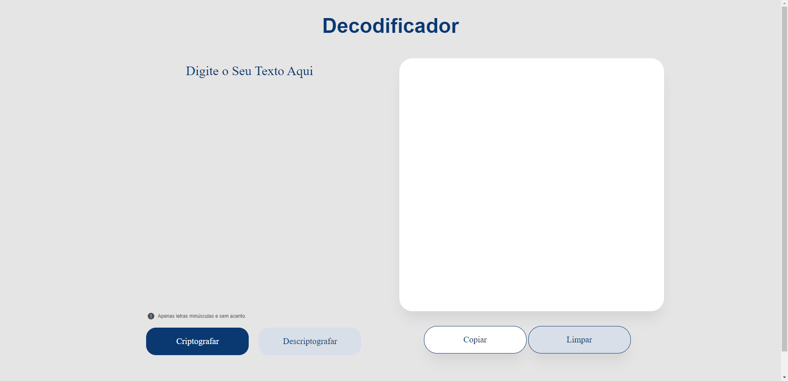

# Decodificador

## Screenshots

 
  

 

# Sobre o projeto

Projeto realizado durante a #oraclenextone realizado Oracle + Alura. Foi desenvolvido uma aplicação que criptografa textos, , assim você poderá trocar mensagens secretas com outras pessoas que saibam o segredo da criptografia utilizada.

## 🧑‍💻 Tecnologias utilizadas

- [HTML](https://developer.mozilla.org/pt-BR/docs/Web/HTML)
- [CSS](https://developer.mozilla.org/pt-BR/docs/Web/CSS)
- [JavaScript](https://developer.mozilla.org/pt-BR/docs/Web/JavaScript)

# Executando a aplicação

Primeiramente clone o repositório para sua maquina ou faça o 'download' em formato ZIP e descompacte. Para realizar a clonagem do repositório utilize o comando:

    git clone https://github.com/vits56/Challenge-Oracle-One

Após basta abrir a pasta e dar dois cliques no arquivo:

    index.html

## License

This project is under license from MIT. For more details, see the [LICENSE](LICENSE) file.

Made with 💜 by <a href="https://github.com/vits56" target="_blank">Bruno Bastos Duarte</a>

&#xa0;

<a href="#top">Back to top</a>
